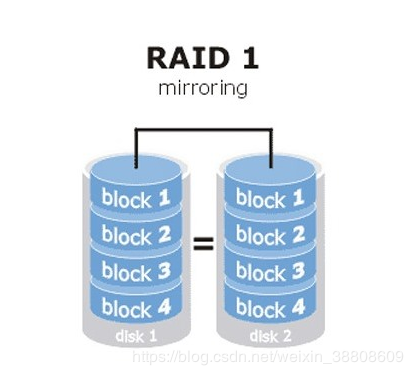
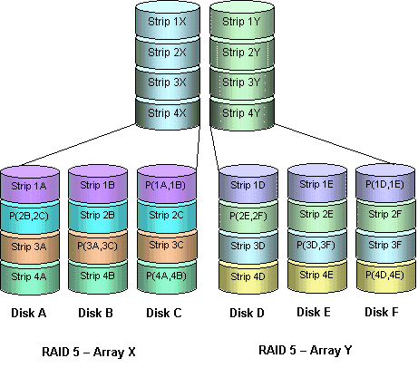

# 编译Storelib库

storelib的修改内容(SAS卡部分)：

1.需要修改slcommon.c中i2c的库文件名以及通信的函数名称，原始为slir3_bmc_i2c.so、master_write_on_bus、writeread_on_bus，需要改为/usr/local/lib/libi2c.so、i2c_master_write_on_bus、i2c_writeread_on_bus

2.不能修改slinternal.h中规定的debug使用的目录文件名称，必须保持slit3combo_bmc_conf.ini、slit3combo_bmc_debug.txt，如果需要修改目录可以按照如下的方法修改，修改sllinux.h中的SL_LINUX_DBG_FILE_PATH宏定义修改为"/var/log"，然后在挂在的ini文件中修改DEBUGDIR=/var/log,可以达到同样的修改debug日志路径的目的

3.需要将slinternal.h中的DEFAULT_I2C_BMC_I2C_ADDRESS改为5

4.需要切换slMCTP.h中i2c的完整性验证为FALSE，SL_INTEGRITY_CHECK SL_FALSE

5.需要修改transpI2CMsg.h中的宏定义修改为#define DEFAULT_I2C_MAX_WRITE_SIZE      64，   #define DEFAULT_I2C_MAX_READ_SIZE       64，   #define DEFAULT_I2C_MAX_READWRITE_SIZE  36，同时需要修改ini_conf文件中对应的三个宏定义


#硬盘状态

存储系统的硬盘有一个状态叫做Foreign，该状态表示这个硬盘在其他的Raid卡上做过Raid，但是又更换了控制器,可以用如下指令清空该状态
```
/opt/MegaRAID/storcli/storcli64 /c0 /fall del
```

#SIGPIPE信号

产生SIGPIPE信号的问题研究

产生原因：对于一个PIPE或者FIFO的写操作，如果是以非阻塞方式只写方式(O_WRONLY)打开的管道，在读端关闭以后，如果还向管道中写数据，则会产生SIGPIPE的信息

避免方式：在PIPE或者FIFO写端打开的时候，指定打开的权限为读写方式(O_WRRD)，这样即使关闭了读端的管道，写数据仍然不会出现SIGPIPE，但是可能造成数据的错位

#Raid级别

**RAID0**

这种配置至少需要1块硬盘支持

RAID 0是最早出现的RAID模式，即Data Stripping数据分条技术。RAID 0是组建磁盘阵列中最简单的一种形式，只需要2块以上的硬盘即可，成本低，可以提高整个磁盘的性能和吞吐量。RAID 0没有提供冗余或错误修复能力，但实现成本是最低的。

RAID 0实现方式就是把N块同样的硬盘用硬件的形式通过智能磁盘控制器或用操作系统中的磁盘驱动程序以软件的方式串联在一起创建一个大的卷集。其读写性能均得到较好的提升，如使用了三块100GB的硬盘组建成RAID 0模式，那么磁盘容量就会是300GB；而速度方面，各单独一块硬盘的速度完全相同。最大的缺点在于RAID 0没有容错能力，任何一块硬盘出现故障，整个系统将会受到破坏，可靠性仅为单独一块硬盘的1/N。


**RAID1**

这种配置至少需要2块硬盘支持

RAID 1称为磁盘镜像，原理是把一个磁盘的数据镜像到另一个磁盘上，也就是说数据在写入一块磁盘的同时，会在另一块闲置的磁盘上生成镜像文件，在不影响性能情况下最大限度的保证系统的可靠性和可修复性上，只要系统中任何一对镜像盘中至少有一块磁盘可以使用，甚至可以在一半数量的硬盘出现问题时系统都可以正常运行,当一块硬盘失效时，系统会忽略该硬盘，转而使用剩余的镜像盘读写数据，具备很好的磁盘冗余能力



**RAID5**

RAID 5（分布式奇偶校验的独立磁盘结构）

这种配置至少需要3块硬盘支持

从它的示意图上可以看到，它的奇偶校验码存在于所有磁盘上，其中的p0代表第0带区的奇偶校验值，其它的意思也相同。RAID5的读出效率很高，写入效率一般，块式的集体访问效率不错。因为奇偶校验码在不同的磁盘上，所以提高了可靠性。但是它对数据传输的并行性解决不好，而且控制器的设计也相当困难。RAID 3 与RAID 5相比，重要的区别在于RAID 3每进行一次数据传输，需涉及到所有的阵列盘。而对于RAID 5来说，大部分数据传输只对一块磁盘操作，可进行并行操作。在RAID 5中有“写损失”，即每一次写操作，将产生四个实际的读/写操作，其中两次读旧的数据及奇偶信息，两次写新的数据及奇偶信息.


**RAID6**

这种配置至少需要4块硬盘支持

RAID6全称为Independent Data Disks with two Independent Distributed Darity Schemes（带有两个独立分布式校验方案的独立数据磁盘）

RAID 6技术是在RAID 5基础上，为了进一步加强数据保护而设计的一种RAID方式，实际上是一种扩展RAID 5等级。与RAID 5的不同之处于除了每个硬盘上都有同级数据XOR校验区外，还有一个针对每个数据块的XOR校验区,RAID 6 是在RAID-5基础上把校验信息由一位增加到两位的RAID级别。

RAID6的优点是快速的读取性能，更高的容错能力；而它的缺点是很慢的写入速度，RAID控制器在设计上更加复杂，成本更高。


**RAID10**

这种配置至少需要4块硬盘支持

RAID 10是一个RAID 1与RAID 0的组合体，它是利用奇偶校验实现条带集镜像，所以它继承了RAID 0的快速和RAID 1的安全。我们知道，RAID 1在这里就是一个冗余的备份阵列，而RAID 0则负责数据的读写阵列。它的优点是同时拥有RAID 0的超凡速度和RAID 1的数据高可靠性，但是CPU占用率同样也更高，而且磁盘的利用率比较低。由于利用了RAID 0极高的读写效率和RAID 1较高的数据保护、恢复能力，使RAID 10成为了一种性价比较高的等级，目前几乎所有的RAID控制卡都支持这一等级。但是，RAID 10对存储容量的利用率和RAID 1一样低，只有50%。因此，RAID10即高可靠性与高效磁盘结构它是一个带区结构加一个镜象结构，可以达到既高效又高速的目的，RAID 10能提供比RAID 5更好的性能。这种新结构的可扩充性不好，这种解决方案被广泛应用，使用此方案比较昂贵。


**RAID50**

它具有RAID 5和RAID 0的共同特性。它由两组RAID 5磁盘组成（每组最少3个），每一组都使用了分布式奇偶位，而两组硬盘再组建成RAID 0，实现跨磁盘抽取数据。RAID 50提供可靠的数据存储和优秀的整体性能，并支持更大的卷尺寸。即使两个物理磁盘发生故障（每个阵列中一个），数据也可以顺利恢复过来。RAID 50最少需要6个驱动器，它最适合需要高可靠性存储、高读取速度、高数据传输性能的应用。这些应用包括事务处理和有许多用户存取小文件的办公应用程序。



