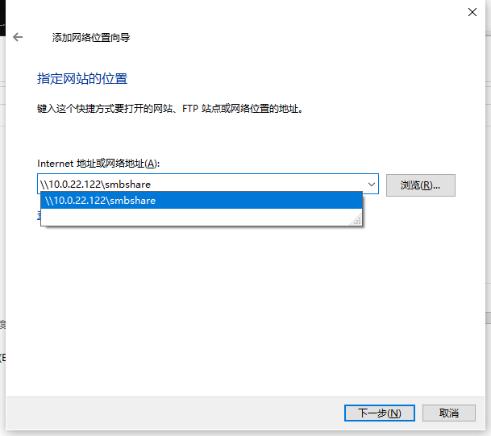
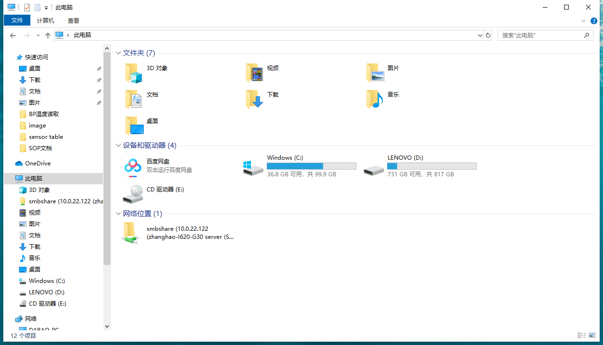
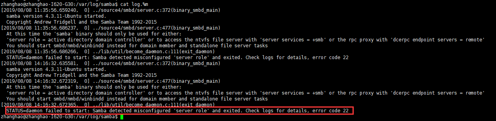

#Samba服务器安装

1.安装Samba服务
```
sudo apt-get install samba
```

2.配置Samba服务

sudo vim /etc/samba/smb.conf

在最后加上
```
[smbshare]
comment = smbshare home directory        #一个标签，随便写
path = /home/zhanghao/sugon/project      #Samba共享出来的目录，必须存在
browseable = yes                         #Samba浏览的权限
writeable = yes                          #Samba写权限
read = yes                               #Samba读权限
```

3.配置Samba用户权限
```
sudo smbpasswd -a zhanghao
```

会要求密码，设置一个访问的密码

4.重启服务
```
sudo /etc/init.d/smbd restart
```

5.windows访问

输入Win+R,利用下边的方式访问: \\ip

随后会需要刚才输入的用户名和密码

清空保存的用户名和密码用如下的方式

打开CMD命令行，输入以下命令：```net use * /del ```来删除所有缓存的访问记录

创建网络位置，方便随时查看

在我的电脑处右键，选择"添加一个网络位置"，后续按照提示添加就可以





6.问题排查

上述配置后，Samba访问会很慢，并且经常伴随这没有权限，查看samba服务的日志（/var/log/samba/log.%m）会发现如下报错：



需要安装daemon

```
sudo apt-get install daemon
```

安装完成后重启Samba服务，windows下访问如丝般流畅
